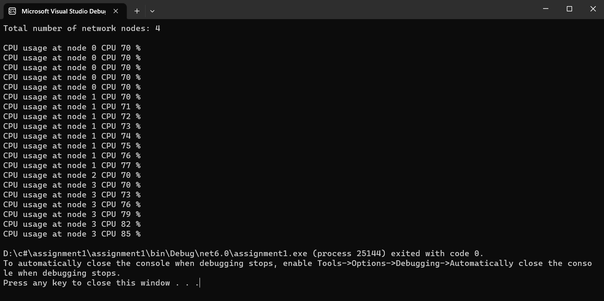

## Ex05-Rec-JaggedArray
## Aim:
To write a C# program to create a sample CPU usage on a network with 4 nodes using a jagged array.
## Algorithm:
## Step1:
Start.

## Step2:
Create a jagged array of 4arrays. int[][] array = new int[4][];

## Step3:
Give the sample CPU usage in the jagged array.

## Step4:
Print the sample CPU usage in the jagged array.

## Step5:
stop.


## Program:
```
using System;
namespace jaggedarray
{
    class cpu_usage
    {
        static void Main(string[] args)
        {
            int[][] array = new int[4][];
            array[0] = new int[5];
            array[1] = new int[8];
            array[2] = new int[1];
            array[3] = new int[6];
            for (int i = 0; i < array.Length; i++)
            {
                for (int j = 0; j < array[i].Length; j++)
                {
                    array[i][j] = i * j + 70;
                }
            }
            Console.WriteLine("Total number of network nodes: " + array.Length + "\n");
            for (int i = 0; i < array.Length; i++)
            {
                for (int j = 0; j < array[i].Length; j++)
                {
                    Console.Write("CPU usage at node {0} CPU {1} %  \n", i, array[i][j]);


                }
            }
        }
    }
}
```
## Output:

## Result:
Thus,C# program to create a sample CPU usage on a network with 4 nodes using a jagged array is executed successfully.
